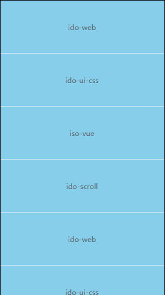

## ido-scroll
一个功能齐全的vue滚动条列表组件

## 集成

```bash
npm i ido-scroll -S
```

## 使用

ido-scroll依赖vue-awesome-swiper@3.1.3，安装本插件的同时也会安装vue-awesome-swiper。
**注意**：使用ido-scroll最外层要包含一个固定高度得容器

```javascript
// 导入组件
import IdoScroll from 'ido-scroll'
// 注册
Vue.use(IdoScroll)
```

使用 Vue.use() 全局注册后，即可在任意页面直接使用了，而不需另外引入。

```html
<ido-scroll></ido-scroll>
```

#### 使用示例

对应example/basic组件



```html
  <div class="box">
    <ido-scroll :data="mData">
      <ul>
        <li class="item" v-for="(item, index) in mData" :key="index">
          {{ item }}
        </li>
      </ul>
      <!-- 其它更多内容... --> 
    </ido-scroll>
  </div>
</template>
```

其中传递参数data，可以是包裹内容的数据，当data数据有变化，ido-scroll会调用update()方法来重新计算高度，当然你也可以自己手动调用update()方法来更新。

#### 下拉刷新和上拉加载示例

对应example/pullToRefresh组件


```html
<div class="box">
    <ido-scroll 
       :data="mData" 
       pullDown 
       pullUp 
       @onRefresh="pullToRefresh" 
       @onLoadmore="pullToLoadmore"
       @pullDownTransitionEnd="pullDownTransitionEnd">
        <ul>
            <li class="item" v-for="(item, index) in mData" :key="index">
                {{ item }}
            </li>
        </ul>
         <!-- 其它更多内容... --> 
    </ido-scroll>
</div>
<script>
    ...
    data() {
        return {
            mData: ['ido-web', 'ido-ui-css', 'iso-vue', 'ido-scroll', 'ido-web', 'ido-ui-css', 'iso-vue', 'ido-scroll']
        }
 	},
	methods: {
       // 下拉刷新回调，需要手动调用end()方法来结束
       pullToRefresh(end) {
          setTimeout(() => {
            end()
          }, 2000)
       },
       // 上拉加载更多回调，需要手动调用end()方法来结束
       pullToLoadmore(end) {
          this.getData()
            .then(end)
            .catch(err => {
              console.log(err)
              end()
            })
        }
        
        // 获取数据
        getData() {
          return new Promise(resolve => {
            setTimeout(() => {
              let newData = ['新来的数据', '新来的数据', '新来的数据', '新来的数据', '新来的数据','新来的数据']
              this.mData = this.mData.concat(newData)
              resolve()
            }, 2000)
          })
        },
 	 }
    ...
</script>
```

- 传递`pullDown`参数来开启下拉刷新，通过监听`onRefresh`事件处理下拉刷新的逻辑，`onRefresh`有一个`end`参数，处理完刷新逻辑，需要手动调用end()方法来结束刷新。
- 传递`pullUp`参数来开启上拉加载，通过监听`onLoadmore`事件处理上拉加载的逻辑，`onReonLoadmoreresh`有一个`end`参数，处理完上拉加载逻辑，需要手动调用end()方法来结束上拉加载。
- `pullDownTransitionEnd`参数是监听下拉刷新完成后，位移动画彻底结束的回调，在这里可以处理自己的一些业务逻辑，最典型的就是，当下拉刷新的时候，我们需要隐藏头部的搜索款，让刷新动画彻底完成，我们要显示头部的搜索框。

## 参数、事件、以及API介绍

参数介绍

| 参数      | 说明                                    | 类型         | 可选值     | 默认值 |
| --------- | --------------------------------------- | ------------ | ---------- | ------ |
| scrollbar | 侧边滚动条的显示与否                    | Boolean      | true/false | true   |
| data      | 内部数据，当数据变化可导致IdoScroll更新 | Array/Object | 一         | 一     |
| pullDown  | 是否开启下拉刷新                        | Boolean      | true/false | false  |
| pullUp    | 是否开启上拉加载                        | Boolean      | true/false | false  |

事件介绍

| 事件名称              | 说明                                       | 回调参数                 | 回调参数说明                                                 |
| --------------------- | ------------------------------------------ | ------------------------ | ------------------------------------------------------------ |
| onRefresh             | 下拉刷新时触发                             | end                      | 当下拉刷新结束后，执行一次end()方法通知组件                  |
| onLoadmore            | 上拉记载时触发                             | end                      | 当上拉加载结束后，执行一次end()方法通知组件                  |
| onScrollEnd           | 滚动停止时触发                             | translate/swiper/pulling | translate: 滚动距离  ；swiper：滚动内容的容器； pulling 是否正在下拉 |
| onScroll              | 滚动时触发                                 | *translate*/swiper       | translate: 滚动距离  ；swiper：滚动内容的容器；              |
| pullDownTransitionEnd | 当下拉刷新动画完全结束后回到初始位置时触发 | 一                       | 一                                                           |

api介绍

| 名称        | 参数                  | 说明                                                         |
| ----------- | --------------------- | ------------------------------------------------------------ |
| update      | 一                    | 更新滚动组件，重新计算高度，当data绑定的数据发生变化， 此方法回被自动触发一次 |
| scrollToTop | speed/*runCallbacks*) | 滚动到顶部。 speed为滚动到顶部的速度，可不传；runCallbacks滚动到顶部触发 |

## 项目中使用实例


## 变更记录
0.1.5
- 【Initial】初始版本


0.1.6
- [add] 对上拉和下载加载增加插槽,方便使用者个性化定制加载动画。
- [Bug Fix] 修复update无效得问题

